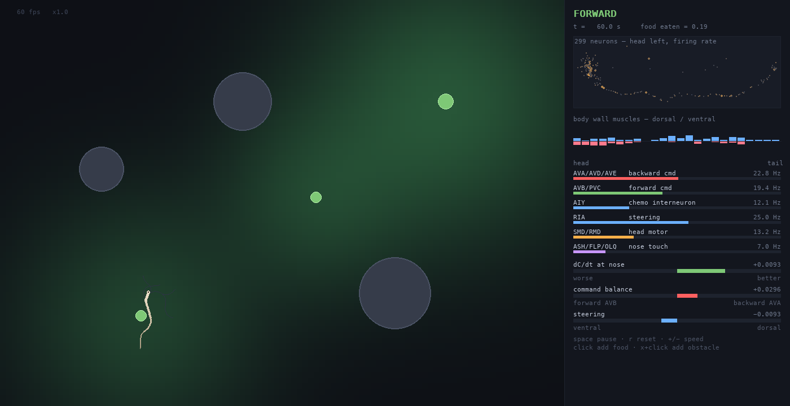
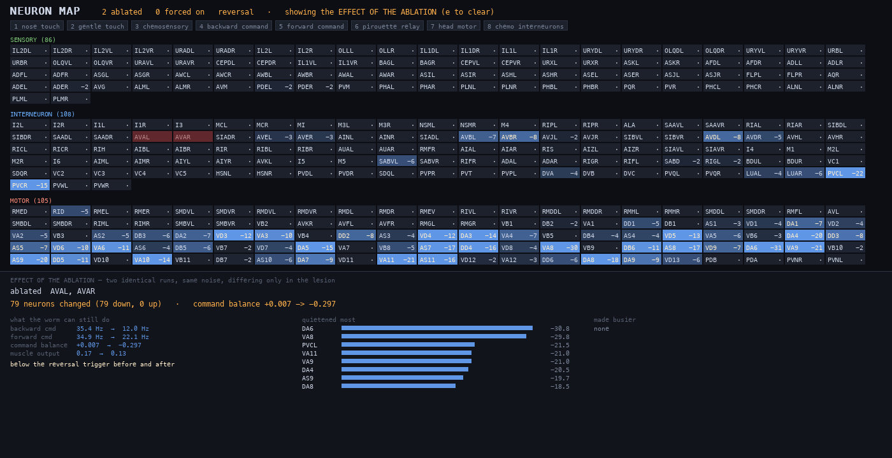

# C. elegans — connectome-drevet simulering

En simulering av *Caenorhabditis elegans* bygget på connectome-dataene fra
[3BIM20162017/CElegansTP](https://github.com/3BIM20162017/CElegansTP), koblet til
en 2D-verden ormen krabber rundt i, lukter seg fram i og støter borti.



## Kjøre

```bash
python3 -m venv .venv && .venv/bin/pip install numpy pygame-ce
.venv/bin/python main.py
```

| Tast | Effekt |
|---|---|
| `tab` | veksle mellom verden og nevronkartet |
| `mellomrom` | pause |
| `r` | start på nytt |
| venstreklikk | legg ut en matflekk (i verden) / velg et nevron (i kartet) |
| høyreklikk | abler nevronet under peker (i kartet) |
| `d` / `s` | abler / tvangsaktiver valgt nevron |
| `e` | mål hva ablasjonen faktisk gjorde |
| `p` | probe-modus: frys kroppen, la nettverket gå |
| `x` + klikk | legg ut en hindring |
| `1`–`8` | slå en hel krets av og på |
| `a` | gjenopprett alt (ablert og tvangsaktivert) |
| `+` / `-` | tidsskala |
| `q` / `esc` | avslutt |

### Nevronkartet og ablasjon



`tab` åpner et kart over alle 299 nevronene, navngitt, gruppert i sensoriske /
interneuroner / motornevroner og sortert hode-til-hale. Hver celle viser
fyringsraten i Hz — tall, ikke bare farge, siden et dusin nyanser av oransje ikke
lar seg skille med øyet. Velger du et nevron, rammes partnerne inn: blått for de
som sender til det, oransje for de som mottar fra det.

Nederst forklares det valgte nevronet i tre kolonner som **holdes bevisst
atskilt**:

- **LITERATURE** — hva cellen antas å gjøre, fra `annotations.py`. Dette er
  ekstern kunnskap fra C. elegans-litteraturen, ikke noe datasettet viser. Alle
  299 nevroner er dekket, annotert per klasse (117 klasser), og der en celle er
  dårlig karakterisert står det heller det enn en oppdiktet rolle.
- **MEASURED** — strukturfakta regnet ut fra connectomet av `analysis.py`:
  inn/ut-vekt, drive-rangering, kroppsposisjon, muskelmålretting med
  segmentspenn, og innflytelse på kommandolaget over ett og to hopp.
- **WHY ACTIVE NOW** — en live dekomponering av strømmen inn i cellen akkurat nå:
  tonisk driv, synaptisk sum, adaptasjon, sensorisk input, og hvilke
  presynaptiske partnere som faktisk driver den i dette millisekundet. Leddene er
  de samme integrasjonssteget summerer, så de går opp.

Det siste er der du får svar på «hvorfor er akkurat denne cellen aktiv». Ofte er
svaret at den *ikke* drives synaptisk i det hele tatt — DB4 kjører på tonisk driv
+28.0 mot en synaptisk sum på +0.01.

**Fargeskalaen er fast (0–40 Hz), ikke normalisert til aktiviteten.** En skala som
følger nettverket får alle overlevende nevroner til å se varmere ut i det du
ablerer de travleste, noe som leses som at resten kompenserer når ingenting slikt
har skjedd. Hver celle skriver raten sin uansett.

### Å måle hva en ablasjon gjorde

Abler noe, trykk **`e`**. Da kjøres et parvis eksperiment: to identiske kopier av
nettverket kjøres side om side fra samme tilstand, med samme frosne sensoriske
input og *samme støyrekke* — de skiller seg bare i om cellene er ablert. Alt som
kommer ut er derfor forårsaket av lesjonen, og støygulvet er null.

Rapporten viser hva ormen fortsatt kan gjøre (bakover- og forover-kommando,
kommandobalanse, muskelutgang), hvilke celler som ble stillest, hvilke som ble
travlere, og om reverseringsterskelen fortsatt nås. Kartet fargelegges samtidig
etter årsakseffekten — blått for roligere, oransje for travlere.

Eksempel, ablasjon av AVAL og AVAR: *79 nevroner endret, 79 ned, 0 opp.*
Bakover-kommandoen faller 35.4 → 12.0 Hz og de hardest rammede er A-type
bakover-motornevroner (DA6 −30.8, VA8 −29.8). Ingen celle blir mer aktiv.

Grunnen til at dette må gjøres som et kontrollert eksperiment og ikke ved å se på
kartet før og etter: en fritt bevegende orm varierer like mye av seg selv som
lesjonen gjør. Uten manipulasjon i det hele tatt flagges 114 av 299 celler som
endret. `p` fryser kroppen om du vil se effekten utfolde seg live i stedet.

**Ablasjon og stimulering.** Høyreklikk (eller `d`) ablerer: nevronet slutter å
fyre og dermed å drive noe nedstrøms, mens koblingene står urørt — nøyaktig
manipulasjonen litteraturen er bygget på. `s` gjør det motsatte og tvangsaktiverer
cellen, den optogenetiske motsatsen. `1`–`8` tar hele kretser (se
`celegans/circuits.py`). Venstreklikk bare *velger*, så det å se på et nevron
aldri forstyrrer kjøringen.

Begge er validerte påstander, ikke bare knapper: fjerner man ASH/FLP/OLQ faller
kommandobalansen ved nese-berøring fra 0.119 til −0.009, altså under
reverseringsterskelen — fluktresponsen forsvinner helt. Tvangsaktivering av AVAL
løfter den fra 50.7 til 71.3 Hz.

Uten vindu: `python main.py --headless 300`. Målingene nedenfor reproduseres med
`python validate.py`.

## Hva dataene inneholder

Kildepakken er ren data — ingen kode. Fire CSV-filer:

| Fil | Innhold |
|---|---|
| `Connectome.csv` | 299 nevroner, 2279 synapser, vekt = antall forbindelser, merket `exc`/`inh` (200 inhibitoriske) |
| `Neurons_to_Muscles.csv` | 118 motornevroner → 94 kroppsveggmuskler, navngitt `M{D,V}{L,R}NN` (dorsal/ventral, venstre/høyre, segment 01–24) |
| `Sensory.csv` | funksjonsmerking for 86 sensoriske nevroner |
| `spatialpositions/distances.csv` | 3D-posisjon per nevron |

## Hvordan det henger sammen

```
verden ──▶ sensing.py ──▶ neural.py ──▶ body.py ──▶ verden
         (sensorstrøm)   (299 LIF-      (kommando-    (bevegelse,
                          nevroner)      avlesning)    kollisjon, spising)
```

**`neural.py`** kjører hvert nevron som en lekk integrate-and-fire-enhet. Et
aksjonspotensial legger ladning i et synaptisk spor som forfaller med `tau_syn`;
connectome-matrisen sprer det til postsynaptiske partnere med fortegn fra
`exc`/`inh`. Samme spor driver musklene gjennom nevron-til-muskel-matrisen.

To ting måtte legges til for at nettverket skulle være brukbart. Bare 9 % av
synapsene er inhibitoriske, så rå rekurrent eksitasjon gjør nettverket bistabilt
— enten helt stille eller mettet, og da forsvinner all selektivitet. Vektmatrisen
normaliseres derfor på spektralradius (så `g_syn` blir løkkeforsterkningen), og
hvert nevron har spike-frekvens-adaptasjon. Resultatet er et nettverk som hviler
på ~11 Hz og graderer med input.

**`body.py`** lar ormen krabbe ved å følge sitt eget hode: den ledende enden
legger ut en bane med oscillerende krumning, og resten av kroppen samples fra
banen med faste buelengdeavstander. Bølgen langs kroppen faller da ut av
hodebanen av seg selv — omtrent slik en ekte orm krabber i sporet den skjærer i
agar. Krumning integreres per *distanse*, ikke per tid, så formen på sporet er
uavhengig av farten.

Connectomet leverer drivet, ikke rytmen: LIF-nettverket har verken gap junctions
eller proprioseptiv tilbakekobling og kan ikke generere en undulasjon selv. Det
som leses ut av det er retning (AVA/AVD/AVE mot AVB/PVC), amplitude og fart (samlet
muskelaktivering), og styring (dorsal/ventral-asymmetri i hodemusklene).

## Hva som kommer fra connectomet, og hva som ikke gjør det

Dette er verdt å være presis på, for det er ikke alt.

**Fra connectomet.** Nese-berøring gir revers helt av seg selv: `gpg-nose`-cellene
(ASH, FLP, OLQ, IL1V) synapser på AVA/AVD/AVE med samlet vekt 104 mot 26 på
AVB/PVC, og målt åpen sløyfe løfter berøring kommandobalansen til 0.119 mot 0.009
i hvile — godt over reverseringsterskelen på 0.085. Ingenting i koden sier
«berøring gir revers»; det følger av koblingene. Hele muskelutgangen, all
segmentering langs kroppen, og hodemotorikkens dorsal/ventral-skille (SMDD 15:3
dorsalt, SMDV 0:10 ventralt, alle utelukkende i segment 1–8) kommer også direkte
fra dataene.

**Ikke fra connectomet.** Kjemotaksi gjør det ikke, og det er en egenskap ved
datasettet, ikke ved tuningen:

- Mat- og luktnevronene har **null** direkte synapser til kommando-interneuronene.
- ASEL og ASER er koblet nesten identisk — begge hovedsakelig til AIY og AIB — så
  ON/OFF-opponensen kjemotaksi hviler på finnes ikke i filen.
- Alle kanter er merket `exc`, så de glutamat-styrte kloridsynapsene der AWC og
  ASER *hemmer* AIY har feil fortegn her.
- Det finnes ingen kompartementer og ingen gap junctions, som er nettopp det RIAs
  styringsberegning er bygget på.

Begge kjemotaksi-strategiene er derfor skrevet ut eksplisitt i `sensing.py`, hver
dokumentert der den brukes, og hver leverer fra seg til connectomet for siste
steg heller enn å diktere atferden:

- **Piruett** — ved fallende gradient drives AIZ og RIB, de eneste
  interneuronene i dette datasettet med entydig bakover-bias (AIZ→AVA 10 mot
  AVB 0; RIB 14 mot 1). Connectomet avgjør selv om det blir en reversering, og
  det gjør det: 93 % av målingene over terskel ved fallende gradient, 0 % ved
  flat eller stigende.
- **Klinotaksi** — RIAs produktregel, sensorisk signal ganget med hodets
  utslag, injisert i de hodemotornevronene connectomet *faktisk* skiller
  dorsalt fra ventralt. Målt korrelasjon mellom drivet og styringsavlesningen:
  +0.78.

En ting til måtte kalibreres bort: hodemusklene er ikke symmetrisk innerverte, og
hvilende dorsal/ventral-ubalanse ligger på ~0.14. Står den, krøller den sporet til
en sirkel på omtrent én kroppslengde og overdøver kjemotaksien fullstendig.
`Locomotion.calibrate` måler den på et ustimulert nettverk før simuleringen
starter.

## Målt atferd

`validate.py` kjører disse, og alle er målinger, ikke påstander:

| Sjekk | Resultat |
|---|---|
| Connectome laster | 299 nevroner, 94 muskler, 2279 synapser |
| Spontanrate | ~11 Hz, stabilt over seeds |
| Fallende gradient → revers | 93 % over terskel, mot 0 % ved stigende |
| Nese-berøring → bakover-kommando | balanse 0.10 mot 0.004 i hvile |
| Ablasjon av nese-kretsen | balanse 0.119 → −0.009, fluktrespons borte |
| Finner mat | når flekken i 5/5 forsøk fra 350 enheter unna |
| Kollisjon → reversering | 8 reverseringer på 561 kontakt-frames |

## Kjent avvik: for mye reversering

Ormen bruker ~41 % av tiden i revers, mot 5–10 % for en ekte orm. Reverseringene
kommer med ~11/min, som i seg selv er innenfor det ekte ormer gjør i lokalsøk —
det er *varigheten* på 2.2 s som gjør andelen høy.

Den er ikke lett å senke, og det er verdt å vite hvorfor. Fire forsøk, alle målt:

| Forsøk | Reversering | Fant mat |
|---|---|---|
| Uendret | 41 % | 4/4 |
| Tregt trendfilter til piruett-beslutningen | 30 % | 1/4 |
| Kortere reversering (1.4 s) | 45 % | 0/4 |
| Kortere + lengre refraktærperiode | 23 % | 0/4 |
| Kortere + kraftigere omega-sving | 26 % | 2/4 |

Årsaken er at piruetten virker ved å reversere *langt nok* til å komme ut av
kursen nedover gradienten. En kort reversering flytter ormen for lite, den
gjenopptar nesten samme kurs, og trigger umiddelbart på nytt — derfor stiger
raten samtidig som atferden slutter å virke. Den lange reverseringen er prisen
for at kjemotaksien fungerer, og konfigurasjonen som er valgt prioriterer
atferden.

## Filer

| Fil | Ansvar |
|---|---|
| `celegans/connectome.py` | leser CSV-ene til numpy-matriser |
| `celegans/neural.py` | LIF-nettverket over hele connectomet |
| `celegans/sensing.py` | verden → sensorisk strøm, og de to kjemotaksi-reglene |
| `celegans/body.py` | kropp, gange, og kommando-avlesningen |
| `celegans/world.py` | arena, luktfelt, mat, hindringer, kollisjon |
| `celegans/render.py` | pygame-visualisering |
| `celegans/simulation.py` | binder det sammen |
| `validate.py` | målingene over |

## Videre

Det mest verdifulle neste steget er å bytte datakilde. Med et connectome som har
gap junctions og riktige fortegn — f.eks. OpenWorms egne data eller
WormAtlas/Cook 2019 — kan piruett- og klinotaksi-reglene fjernes og testes mot om
atferden da faller ut av koblingene alene. Slik koden er delt opp er det bare
`sensing.py` som må endres.

## Lisens

Koden er MIT-lisensiert, se `LICENSE`.

Dataene under `data/` er **ikke** dekket av den. De er lagt ved for at prosjektet
skal kunne kjøres direkte, og kommer fra
[3BIM20162017/CElegansTP](https://github.com/3BIM20162017/CElegansTP), som
publiserer dem uten egen lisens; selve koblingsdataene stammer fra OpenWorm.
Skal du gjenbruke dataene framfor koden, sjekk opphavet selv.
